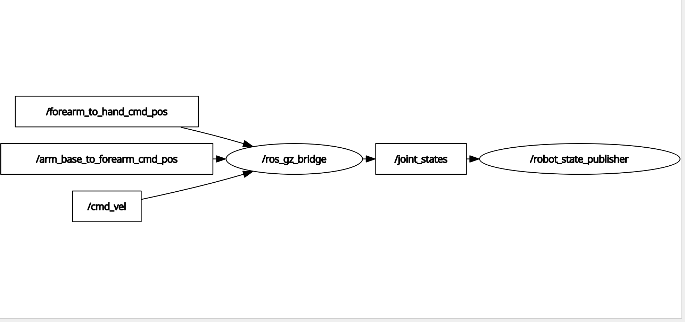

# final_robot


## Node Graph / ノードグラフ


## ROS2 Level 2 Final Project — Robotic Arm on Mobile Base

A differential-drive mobile robot with a 2-DOF robotic arm, simulated in Gazebo Harmonic with ROS2 Jazzy.

### Features
- Differential-drive mobile base (cmd_vel control)
- 2-axis robotic arm with JointPositionController
- Gazebo Bridge (ROS2 ↔ Gazebo)
- Modular xacro design (mobile_base, arm, common_properties)

### Package Structure
```
final_robot/
├── final_robot_description/    # Robot URDF, launch, RViz config
└── final_robot_bringup/        # Gazebo launch, bridge config, worlds
```

### Requirements
- ROS2 Jazzy
- Gazebo Harmonic
- ros_gz_bridge, ros_gz_sim

### Installation
```bash
cd ~/ros2_ws/src
git clone https://github.com/AhmetEsme/final_robot.git
cd ~/ros2_ws
colcon build --symlink-install
source install/setup.bash
```

### Usage

**RViz (arm visualization):**
```bash
ros2 launch final_robot_description display.launch.py
```

**Gazebo (full simulation):**
```bash
ros2 launch final_robot_bringup final_robot_gazebo.launch.py
```

**Move the robot:**
```bash
ros2 topic pub /cmd_vel geometry_msgs/msg/Twist "{linear: {x: 0.5}, angular: {z: 0.3}}"
```

**Move the arm:**
```bash
ros2 topic pub /arm_base_to_forearm_cmd_pos std_msgs/msg/Float64 "data: 0.5"
ros2 topic pub /forearm_to_hand_cmd_pos std_msgs/msg/Float64 "data: 0.5"
```

---

## ROS2 レベル2 最終プロジェクト — モバイルベース上のロボットアーム

差動駆動モバイルロボットに2自由度ロボットアームを搭載し、Gazebo HarmonicとROS2 Jazzyでシミュレーションしたプロジェクトです。

### 特徴
- 差動駆動モバイルベース（cmd_vel制御）
- 2軸ロボットアーム（JointPositionController）
- Gazebo Bridge（ROS2 ↔ Gazebo）
- モジュラーxacro設計（mobile_base、arm、common_properties）

### パッケージ構成
```
final_robot/
├── final_robot_description/    # ロボットURDF、launch、RViz設定
└── final_robot_bringup/        # Gazebo launch、ブリッジ設定、ワールド
```

### 必要環境
- ROS2 Jazzy
- Gazebo Harmonic
- ros_gz_bridge、ros_gz_sim

### インストール
```bash
cd ~/ros2_ws/src
git clone https://github.com/AhmetEsme/final_robot.git
cd ~/ros2_ws
colcon build --symlink-install
source install/setup.bash
```

### 使い方

**RViz（アーム可視化）:**
```bash
ros2 launch final_robot_description display.launch.py
```

**Gazebo（完全シミュレーション）:**
```bash
ros2 launch final_robot_bringup final_robot_gazebo.launch.py
```

**ロボットを動かす:**
```bash
ros2 topic pub /cmd_vel geometry_msgs/msg/Twist "{linear: {x: 0.5}, angular: {z: 0.3}}"
```

**アームを動かす:**
```bash
ros2 topic pub /arm_base_to_forearm_cmd_pos std_msgs/msg/Float64 "data: 0.5"
ros2 topic pub /forearm_to_hand_cmd_pos std_msgs/msg/Float64 "data: 0.5"
```

---

**Author:** Ahmet Esme ([@AhmetEsme](https://github.com/AhmetEsme))  
**Environment:** ROS2 Jazzy + Gazebo Harmonic + Ubuntu 24.04